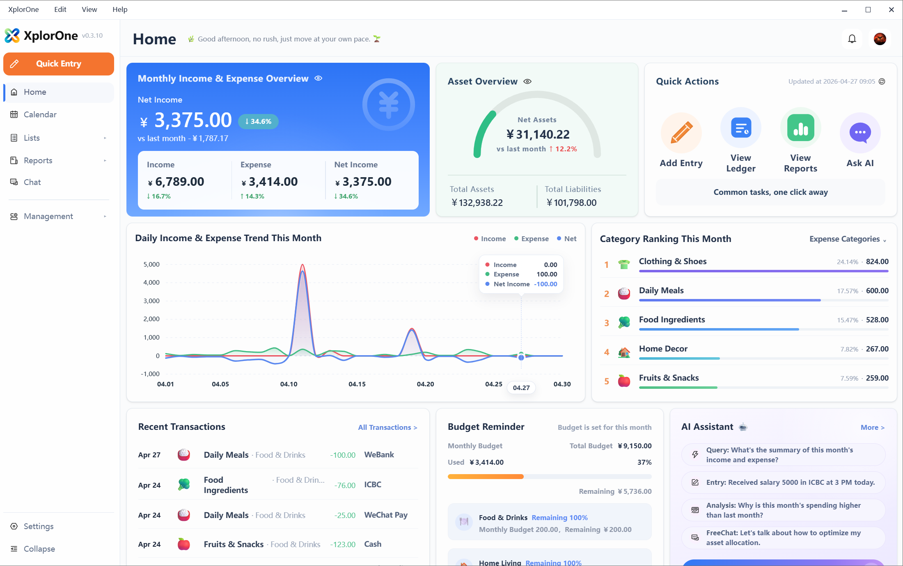

English | [简体中文](./README_zh-CN.md)

# XplorOne

**A local-first AI finance workspace for solopreneurs.**

XplorOne helps freelancers, one-person businesses, consultants, indie makers, and small studios understand income, expenses, cash flow, budgets, accounts, and financial patterns — without starting from a cloud-first workflow.

**Current status:** Windows release available · Core local bookkeeping, reports, and basic queries work without an API key · BYOK: core local workflows work without an API key; AI Assistant features require a user-configured model API key · Write actions require confirmation · Local API and MCP integrations are token-protected local access paths · This repository is the public product hub for releases, documentation, and community feedback, not a full open-source code landing page.

[Download on GitHub Releases](https://github.com/SimonZhangM/XplorOne/releases) · [Getting Started](./docs/getting-started.md) · [WAIC Project Plan](./docs/waic/XplorOne-WAIC-FutureTech-OPC-Project-Plan.pdf) · [Discussions](https://github.com/SimonZhangM/XplorOne/discussions)

---

## Latest Release

Current public release: **v0.4.1 for Windows**.

Download from [GitHub Releases](https://github.com/SimonZhangM/XplorOne/releases) or xplorone.com when available. For a quick summary, see [Changelog](./CHANGELOG.md). For complete user-facing release notes, see [Software Release History](./docs/software-release-history.md).

## Why XplorOne

- **Your books stay on your computer by default**  
  XplorOne is built around a local-first workflow, so your financial data does not begin as “just another cloud database”.

- **Local Assistant and AI Assistant serve different finance workflows**
  Local Assistant helps with local query and entry workflows. AI Assistant helps with deeper analysis and broader finance-related conversations.

- **Built for one-person businesses and small studios, not enterprise finance teams**  
  XplorOne is designed for people running their own work and financial workflow, not for large multi-team accounting operations.

- **Clear boundaries are part of the product**  
  Supported local query flows do not silently fall back to AI guessing, and write actions always require confirmation.

## What You Can Do Today

- **Manage multiple books, accounts, categories, budgets, and transactions**  
  Build a financial structure that is easier to review than a flat list of records.

- **Use Local Assistant and AI Assistant for finance workflows**
  Use Local Assistant for local queries and entry workflows, and AI Assistant for model-assisted analysis and broader finance-related conversation.

- **Review cash flow, income, expenses, assets, liabilities, and charts**  
  Understand trends, category structure, account states, and broader financial patterns.

- **Back up, restore, export, archive, and import your data**  
  Keep your workflow portable, recoverable, and under your control over time.

- **Connect external agents through a token-protected local read-only MCP/query path**  
  XplorOne includes a local read-only access path for AI-native workflows. MCP access goes through XplorOne’s controlled local API and query layers rather than reading the database directly.

## Local Data and Integration Boundaries

XplorOne is designed around a local-first desktop workflow.

- **Local app data by default**  
  Runtime data is stored in the user’s local application data environment, including the main ledger database and configuration metadata.

- **Separate credential types**  
  Model API keys are used for AI-assisted features. Local API and MCP tokens are used for local integrations.

- **Protected local credentials**  
  Model API keys and MCP client tokens are treated as protected local credentials and stored through Electron `safeStorage` or an equivalent system-protected storage mechanism.

- **Token-protected local access**  
  Local API and MCP access are protected by bearer tokens and are intended for local loopback integration.

- **Read-only MCP access**  
  The current MCP path is read-only and goes through XplorOne’s local API and query layers rather than direct database access.

## AI Boundaries

XplorOne remains usable as a local-first finance workspace even without an API key. The API key only unlocks AI-assisted capabilities on top of the core local workflow.

XplorOne separates assistant workflows:

- **Local Assistant** helps with supported local query and entry workflows.
- **AI Assistant** helps with deeper analysis and broader finance-related conversations.

But:

- **write actions require user confirmation**
- **nothing is written automatically**

This means XplorOne is not “upload everything to the cloud and let the model mutate your books”. It is designed to keep local workflows local where supported, use model assistance only where appropriate, and preserve explicit write boundaries.

For more details, see [Privacy & AI Boundaries](./docs/privacy-and-ai-boundaries.md).

## Quick Start

1. [Download the latest Windows release](https://github.com/SimonZhangM/XplorOne/releases)
2. Create or open a book after first launch  
3. Start with local bookkeeping, reports, and basic queries right away  
4. Add your own API key if you want AI Assistant analysis and broader finance-related conversations

For full setup details, see [Getting Started](./docs/getting-started.md) and [BYOK Setup](./docs/byok-setup.md).

## Current Release Status

- **Windows is the current official release line**
- **Core local bookkeeping, reports, and basic queries work without an API key**
- **A user-configured API key is only required for AI-assisted features**
- **Local API and MCP integrations are token-protected local access paths**
- **Web preview is for development only and is not an end-user release**
- **XplorOne is not an all-in-one cloud accounting suite for every team or region**

## About This Repository

This repository serves as the public product hub for XplorOne, including:

- documentation
- releases
- roadmap updates
- community feedback

It is designed as the main public-facing hub for the product, rather than a source-first landing page.

## Help and Feedback

- **[Discussions](https://github.com/SimonZhangM/XplorOne/discussions)** — questions, feedback, ideas, and product discussion
- **[Issues](https://github.com/SimonZhangM/XplorOne/issues)** — bug reports, installer problems, and clearly actionable issues
- **[Releases](https://github.com/SimonZhangM/XplorOne/releases)** — downloads and release notes
- **[Changelog](./CHANGELOG.md)** — major release highlights
- **[Software Release History](./docs/software-release-history.md)** — detailed user-facing release notes
- **[Privacy](./PRIVACY.md)** — formal privacy statement for public users
- **[Security](./SECURITY.md)** — security reporting and sensitive issue guidance
- **[Screenshots](./docs/screenshots.md)** — visual product tour

## License and Usage

XplorOne is proprietary software and is not released under an open source license unless expressly stated otherwise.

- The source code in this repository is not offered under an open source license.
- Repository-level proprietary license terms are described in [LICENSE](./LICENSE).
- Official desktop releases are governed by the applicable [EULA.md](./EULA.md).
- Third-party components remain subject to their own license terms. See [THIRD_PARTY_NOTICES.md](./THIRD_PARTY_NOTICES.md).
- The XplorOne name, logo, and related branding are proprietary and may not be used without permission.

For distribution, licensing, OEM, white-label, integration, or commercial inquiries:

- simonzhang2026@163.com
- www.xplorone.com
