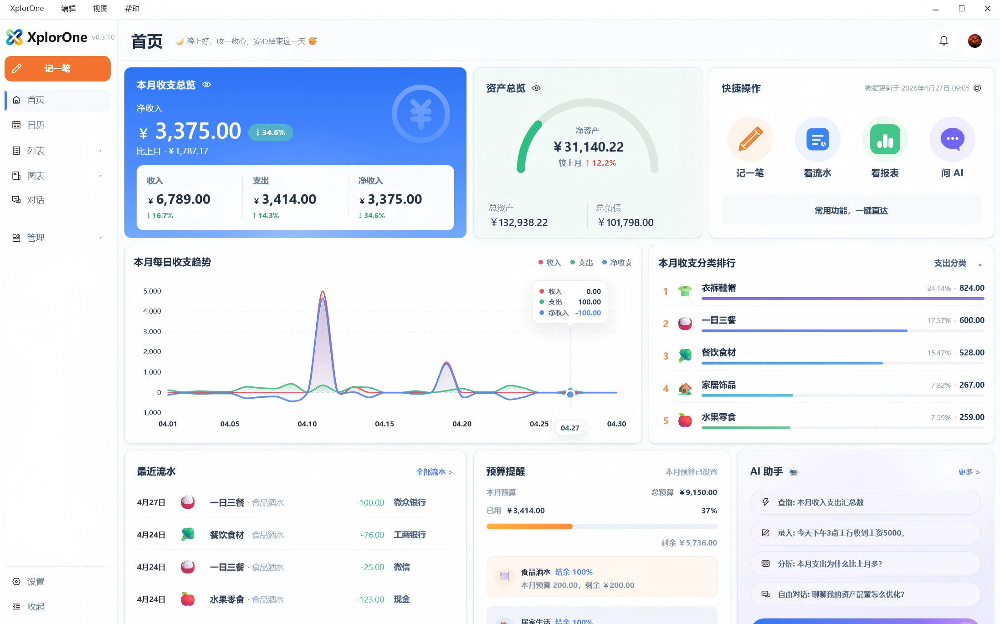

[English](./README.md) | 简体中文

# XplorOne

**一款面向超级个体与自由职业者的本地优先 AI 财务工作台。**

XplorOne 帮助自由职业者、一人公司经营者、顾问、独立开发者、小型工作室主理人更清楚地看懂收入、支出、现金流、预算、账户结构和财务变化，而不是把整个财务工作流建立在一个云端优先的系统之上。

**当前状态：** Windows 版本已可下载 · 即使没有 API Key，你也可以完成本地记账、查看财务报表和基础查询 · BYOK：核心本地功能无需 API Key；AI 助手能力需要用户自行配置模型 API Key · 涉及写入的操作必须用户确认 · 本地 API 与 MCP 集成属于 token 保护的本地访问路径 · 本仓库用于版本发布、文档说明与社区反馈，并非完整开源代码仓库首页。

[下载 Windows 版本](https://github.com/SimonZhangM/XplorOne/releases) · [快速开始](./docs/getting-started_zh-CN.md) · [WAIC 项目计划书](./docs/waic/XplorOne-WAIC-FutureTech-OPC-Project-Plan.pdf) · [讨论与反馈](https://github.com/SimonZhangM/XplorOne/discussions)

---

## 最新版本

当前公开版本：**Windows v0.4.1**。

可从 [GitHub Releases](https://github.com/SimonZhangM/XplorOne/releases) 下载；官网可用时也可从 xplorone.com 获取。快速摘要请见 [Changelog](./CHANGELOG.md)，完整用户向版本说明请见 [软件版本历史](./docs/software-release-history_zh-CN.md)。

## 为什么是 XplorOne

- **你的账本默认保存在自己的电脑里**  
  XplorOne 以本地优先为前提来设计，不把财务数据默认变成“另一个云端数据库”。

- **本地助手和 AI 助手分别服务不同财务工作流**
  本地助手用于本地查询和录入工作流；AI 助手用于更深入的分析和开放式财务对话。

- **它是为一人公司和小型工作室设计的，不是企业级财务大系统**  
  XplorOne 更适合自己做业务、自己经营、自己管理收入与支出的人，而不是大型团队协同财务系统。

- **清晰的边界，本身就是产品价值的一部分**  
  受支持的本地查询不会悄悄 fallback 到 AI 猜 intent，任何写入也必须经过用户确认。

## 你现在可以做什么

- **管理多个账本，以及账户、分类、预算和流水**  
  把原本零散的财务记录整理成更容易理解和复盘的结构。

- **通过本地助手和 AI 助手处理财务工作流**
  本地助手用于本地查询和录入工作流；AI 助手用于模型辅助分析和更开放的财务相关对话。

- **查看现金流、收支、资产负债与图表**  
  看到趋势、看到分类结构、看到账户状态，也看到更整体的财务变化。

- **备份、恢复、导出、归档与导入数据**  
  让你的财务工作流保持可迁移、可恢复、可长期使用。

- **通过 token 保护的本地只读 MCP / query 路径连接外部 agent**  
  对 AI-native 工作流来说，XplorOne 提供当前账本的本地只读查询能力。MCP 访问会经过 XplorOne 受控的本地 API 与查询链路，而不是绕过应用直接读取数据库。

## 本地数据与集成边界

XplorOne 以本地优先的桌面工作流为基础来设计。

- **默认使用本地应用数据环境**  
  运行时数据保存在用户自己的本地应用数据环境中，包括主账本数据库和必要的配置元信息。

- **不同凭据承担不同职责**  
  模型 API Key 用于 AI 辅助能力；本地 API 与 MCP token 用于本机环境中的本地集成访问。

- **敏感凭据本地保护**  
  模型 API Key 与 MCP client token 会作为受保护的本地凭据处理，并通过 Electron `safeStorage` 或等效的系统级保护机制保存。

- **本地访问通过 token 保护**  
  本地 API 与 MCP 访问使用 bearer token 进行保护，并主要面向本机回环环境中的本地集成。

- **MCP 当前为只读访问**  
  当前 MCP 路径只开放只读查询，并通过 XplorOne 的本地 API 与查询链路执行，而不是绕过应用直接读取数据库。

## AI 边界

即使没有 API Key，XplorOne 也依然可以作为一个本地优先的财务工作台使用；API Key 只是用于在核心本地工作流之上启用 AI 辅助能力。

XplorOne 会区分不同助手工作流：

- **本地助手** 用于受支持的本地查询和录入工作流。
- **AI 助手** 用于更深入的分析和更开放的财务相关对话。

但同时也明确遵守这些边界：

- **任何写入都需要用户确认**
- **不会自动写入账本**

这意味着，XplorOne 不是那种“先把数据丢进云里，再让模型自由改账”的产品。  
它更强调：受支持的本地工作流尽量保持本地处理，在需要时使用模型辅助，并把写入边界保留给用户自己。

更详细的说明，请见：[隐私与 AI 边界](./docs/privacy-and-ai-boundaries_zh-CN.md)

## 快速开始

1. [下载最新 Windows 版本](https://github.com/SimonZhangM/XplorOne/releases)
2. 首次启动后创建或打开一个账本  
3. 先直接开始本地记账、查看报表和使用基础查询  
4. 如果你需要 AI 助手的分析和更开放的财务相关对话，再配置自己的 API Key

完整说明请见：[快速开始](./docs/getting-started_zh-CN.md) 与 [BYOK 配置说明](./docs/byok-setup_zh-CN.md)

## 当前发布状态

- **Windows 是当前正式发布线**
- **即使没有 API Key，也可以完成本地记账、查看财务报表和基础查询**
- **AI 助手分析和更开放的财务相关对话需要用户自行配置 API Key**
- **本地 API 与 MCP 集成属于 token 保护的本地访问路径**
- **Web 预览仅用于开发，不是正式终端用户发布形态**
- **XplorOne 并不是一个面向所有团队、所有地区、所有协作场景的大而全云端财务系统**

## 关于这个仓库

这个仓库是 XplorOne 的公开产品入口，承接：

- 文档说明
- 版本发布
- 路线更新
- 社区反馈

它的定位是 **产品公开主页**，而不只是一个“以源码为中心”的落地页。

## 帮助与反馈

- **[Discussions](https://github.com/SimonZhangM/XplorOne/discussions)** —— 问题、想法、反馈与产品讨论
- **[Issues](https://github.com/SimonZhangM/XplorOne/issues)** —— bug、安装问题和可明确处理的问题
- **[Releases](https://github.com/SimonZhangM/XplorOne/releases)** —— 下载版本与查看更新说明
- **[Changelog](./CHANGELOG.md)** —— 主要版本变化摘要
- **[软件版本历史](./docs/software-release-history_zh-CN.md)** —— 面向用户的详细版本说明
- **[隐私说明](./PRIVACY_zh-CN.md)** —— 面向公开用户的正式隐私说明
- **[安全说明](./SECURITY_zh-CN.md)** —— 安全问题反馈与敏感信息处理说明
- **[截图导览](./docs/screenshots_zh-CN.md)** —— 产品界面的视觉导览

## 授权与使用说明

XplorOne 是专有软件；除非另有明确说明，否则并非以开源许可证发布。

- 本仓库中的源代码并未以开源许可证提供
- 仓库层面的专有授权边界见 [LICENSE](./LICENSE)
- 官方桌面版本受对应的 [EULA.md](./EULA.md) 约束
- 第三方组件仍受其各自许可证约束，详见 [THIRD_PARTY_NOTICES.md](./THIRD_PARTY_NOTICES.md)
- `XplorOne` 名称、logo 及相关品牌标识均为专有品牌，未经许可不得使用

如需咨询分发、授权、集成、OEM、白标或商业合作，请联系：

- simonzhang2026@163.com
- www.xplorone.com
