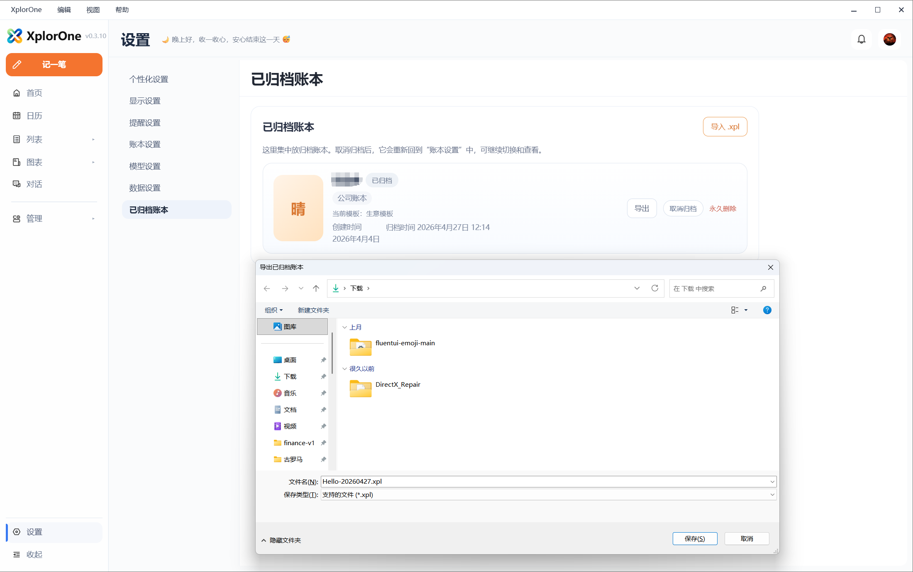
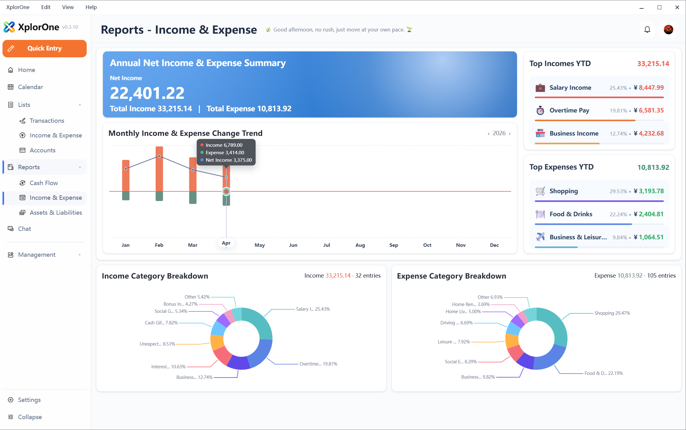
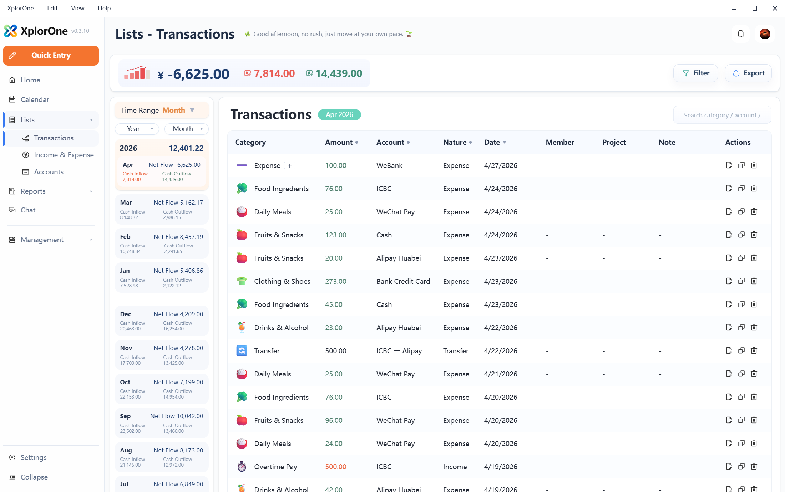
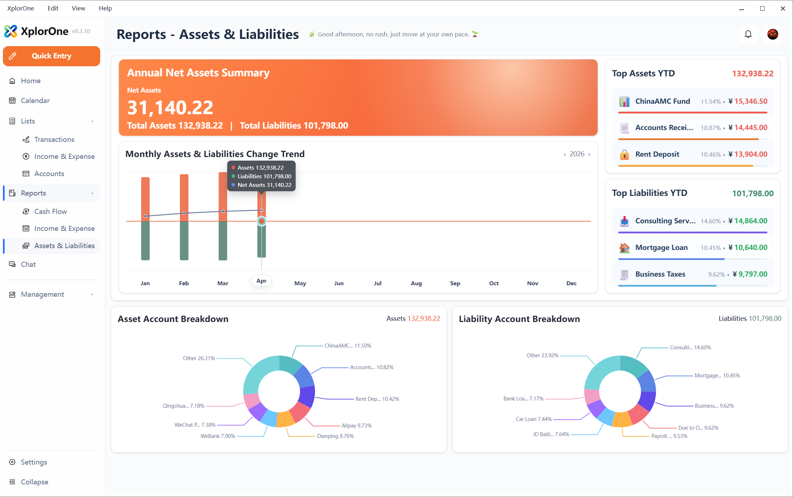
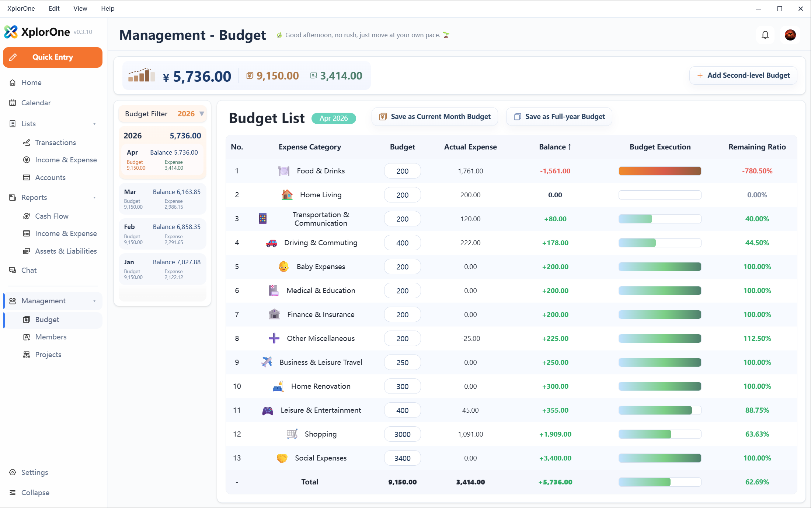
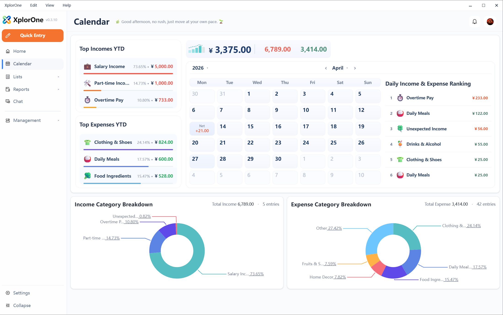
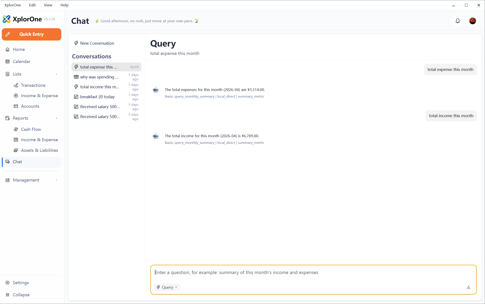
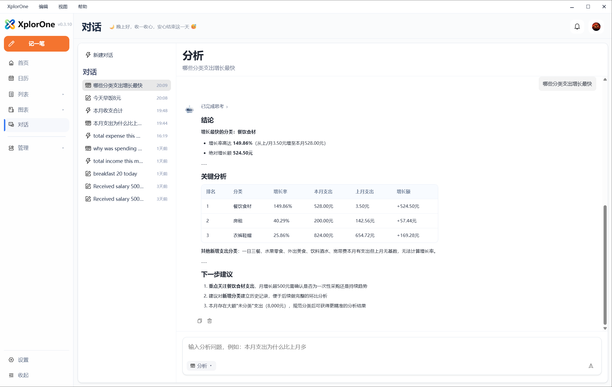
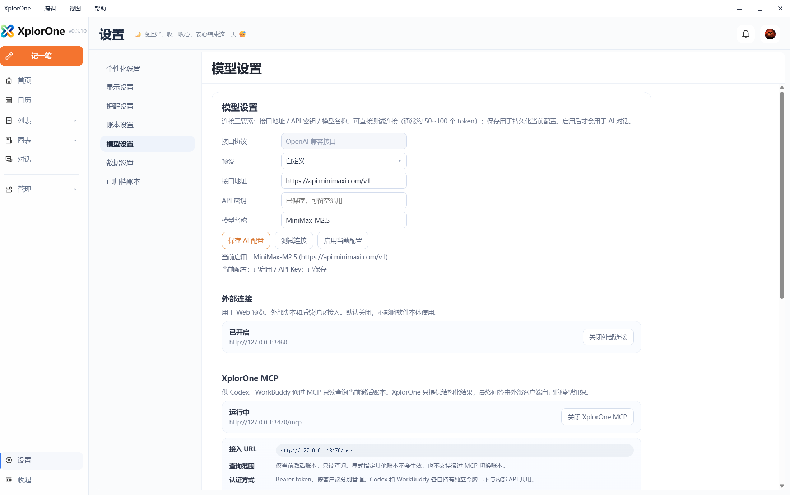

English | [简体中文](./screenshots_zh-CN.md)

# Product Screenshots

This page organizes the public screenshot assets used by the XplorOne GitHub product hub.

Screenshots may reflect a specific release moment. For current availability, check [GitHub Releases](https://github.com/SimonZhangM/XplorOne/releases) and [Software Release History](./software-release-history.md).

## Home

Home is the main finance workbench for review, summaries, recent transactions, and common actions.

## Transactions

Transactions show recorded financial activity and support review of actual cash movement.

## Income and Expense

Income and Expense views help users understand category structure and where money comes from or goes.

## Cash Flow

Cash Flow focuses on money movement, inflow, outflow, and net flow.

## Assets and Liabilities

Assets and Liabilities help users review financial position and account balance trends.

## Budget

Budget helps compare expected spending with actual spending.

## Calendar

Calendar gives a date-based view of income and expense activity.

## Chat and AI Assistant

Chat is organized around Local Assistant and AI Assistant workflows.

Analysis helps users interpret structured financial context.

## Local API and MCP

Local API and MCP are optional local integration surfaces for advanced agent workflows.

