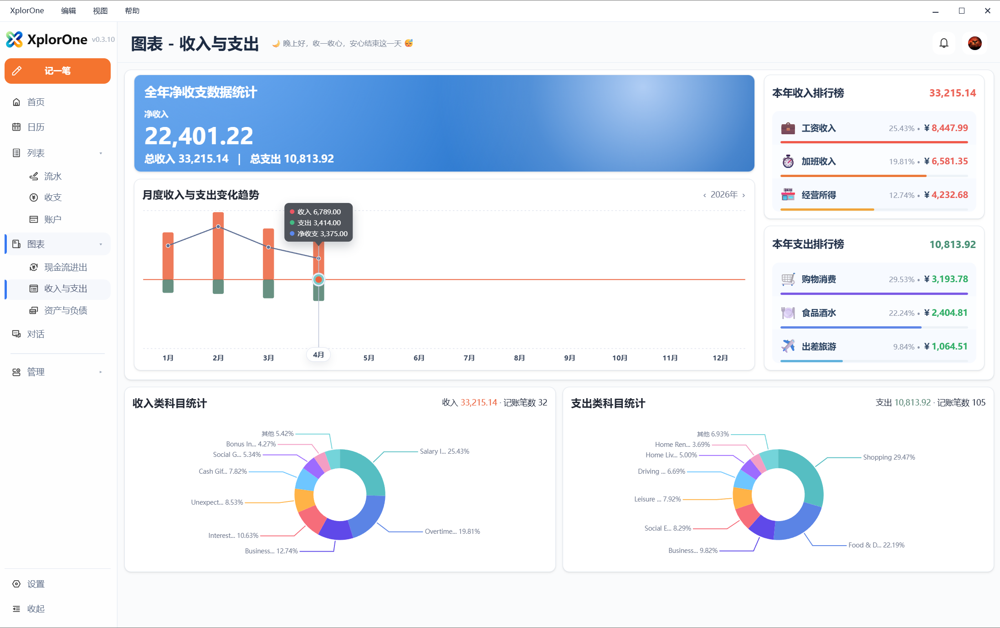
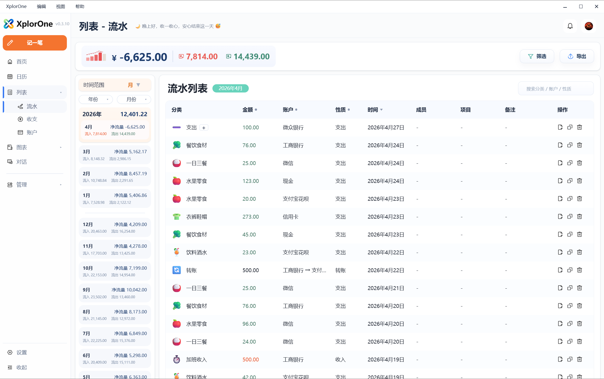
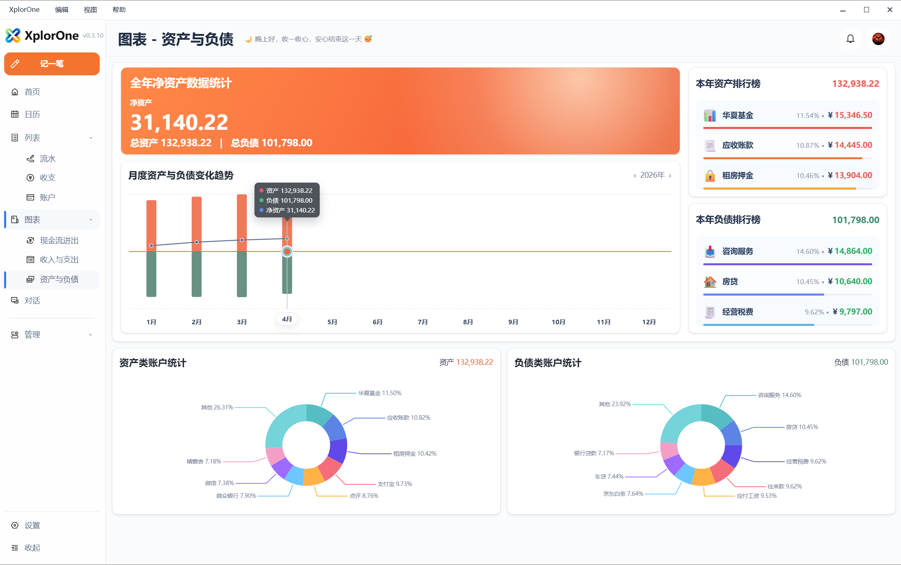
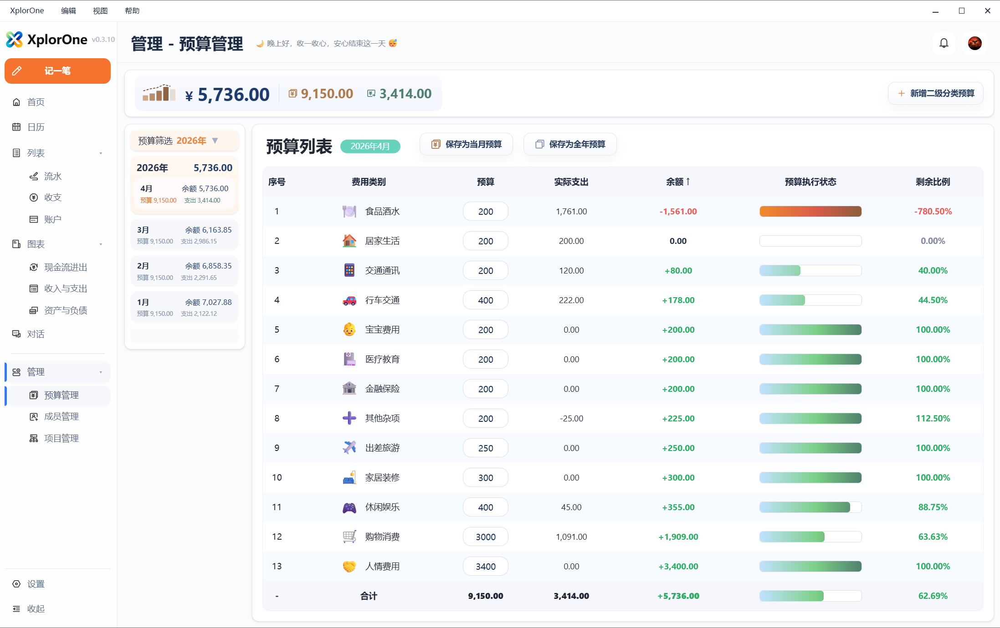
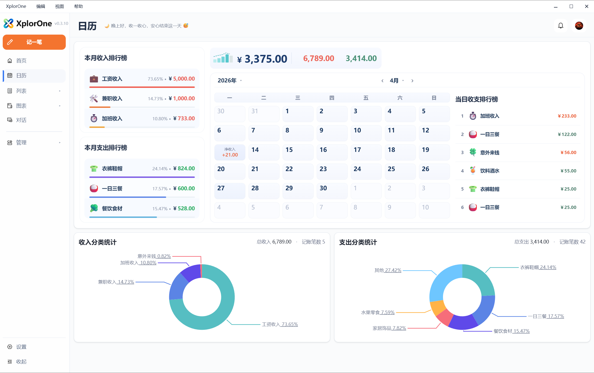

[English](./screenshots.md) | 简体中文

# 产品截图

这页用于组织 XplorOne GitHub 产品仓库中的公开截图素材。

截图可能对应某个具体发布时点。当前可用能力请以 [GitHub Releases](https://github.com/SimonZhangM/XplorOne/releases) 和 [软件版本历史](./software-release-history_zh-CN.md) 为准。

## 首页

首页是财务工作台，用于查看概览、近期流水和常用操作。

## 流水

流水用于查看已记录的财务活动和实际资金流动。

## 收支

收支视图帮助用户理解分类结构、收入来源和支出去向。

## 现金流

现金流关注资金流入、流出和净流动。

## 资产负债

资产负债帮助用户查看财务状态和账户余额趋势。

## 预算

预算用于对比预期支出和实际支出。

## 日历

日历提供按日期查看收入与支出的方式。

## 对话与 AI 助手

对话区域围绕本地助手和 AI 助手工作流展开。

分析用于帮助用户理解结构化财务上下文。

## 本地 API 与 MCP

本地 API 与 MCP 是面向高级 agent 工作流的可选本地集成界面。

